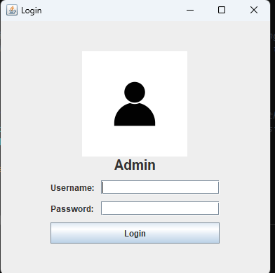
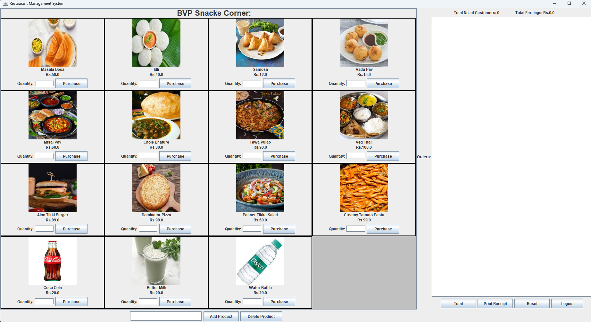
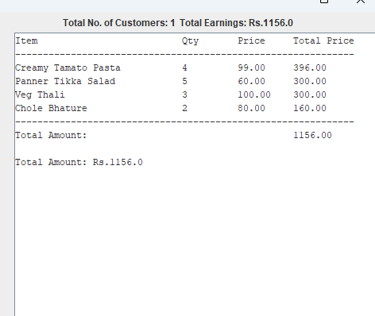
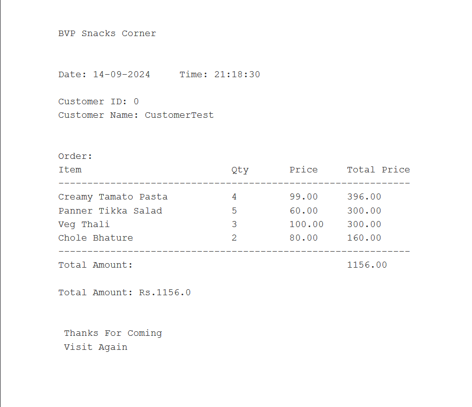

# Restaurant Management System

## Overview
The **Restaurant Management System** is a desktop-based application built using Java Swing for managing a small restaurant. It provides functionalities for adding, deleting, and purchasing products, maintaining customer order history, calculating total earnings, and printing receipts. This system is designed for ease of use and helps streamline restaurant management tasks.

## Features
- **Product Management**: 
  - Add products with details such as name, price, and image.
  - Delete existing products from the list.
  - Search for products by name.
  
- **Order Management**: 
  - Select products, specify the quantity, and purchase them.
  - View ordered products and calculate the total amount for each order.
  - Print receipts with customer name, order details, date, and time.
  - Reset orders after completion.
  
- **Customer and Earnings Tracking**:
  - Track the total number of customers.
  - Keep a record of total earnings from all orders.

- **Logout Functionality**: 
  - The system provides an option to log out, returning the user to the login page.

## Prerequisites
- Java 8 or higher must be installed on your machine.
- A development environment (like IntelliJ IDEA or Eclipse) for running and testing the application.

## Installation and Running
1. Clone this repository or download the project.
2. Open the project in your Java IDE of choice.
3. Make sure your IDE has the necessary libraries for Java Swing.
4. Compile and run the `RestaurantManagementSystem.java` file.

## Usage
- **Add Product**: 
  - Click on the `Add Product` button, provide the product name, price, and image, then save it to the product list.
  
- **Delete Product**:
  - Select a product from the list and click on the `Delete Product` button to remove it from the system.
  
- **Place Orders**:
  - Enter a quantity for a product and click `Purchase` to add it to the order list. 
  - View and modify the order summary in the right panel.
  
- **Total & Receipt**:
  - Click `Total` to calculate the total cost of the current order.
  - Click `Print Receipt` to print the order with customer details.

- **Reset**:
  - Reset the current order list and quantity fields with the `Reset` button.

- **Logout**:
  - The `Logout` button logs out the user and closes the application window.

## Dependencies
- Java Swing for the GUI
- Java AWT for handling low-level user input and output

## Screenshots

## License
This project is open-source and can be modified for personal use.

---

Enjoy managing your restaurant efficiently with the Restaurant Management System! 😊
